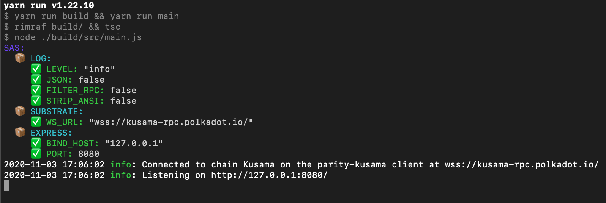
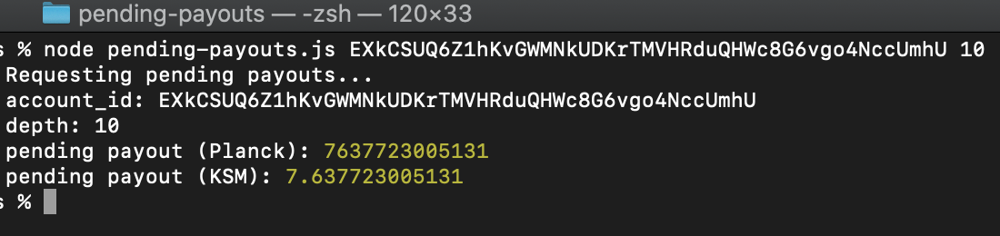

# [ADVANCED CHALLENGE] REST APIs - Read An Account's Pending Payouts

## Project Description

Script to calculate pending payouts by sending HTTP requests to a local Sidecar instance

## Getting started 

Install sidecar instance

```
yarn add @substrate/api-sidecar
```

Configure a Kusama environment and start from there

```
NODE_ENV=kusama yarn start
```

Pick up a random validator from https://kusama.subscan.io/validator and run the script

```
node pending-payouts.js <ACCOUNT_ID> <DEPTH>
```

#### sidecar local instance
<p align="center">
  
</p>

#### script output
<p align="center">
  
</p>


